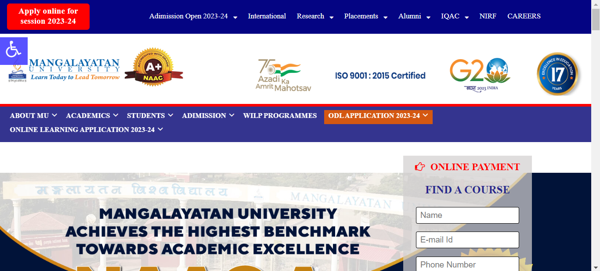
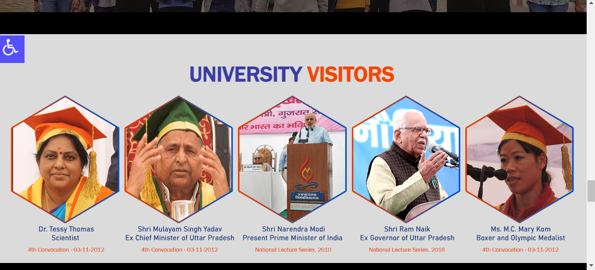
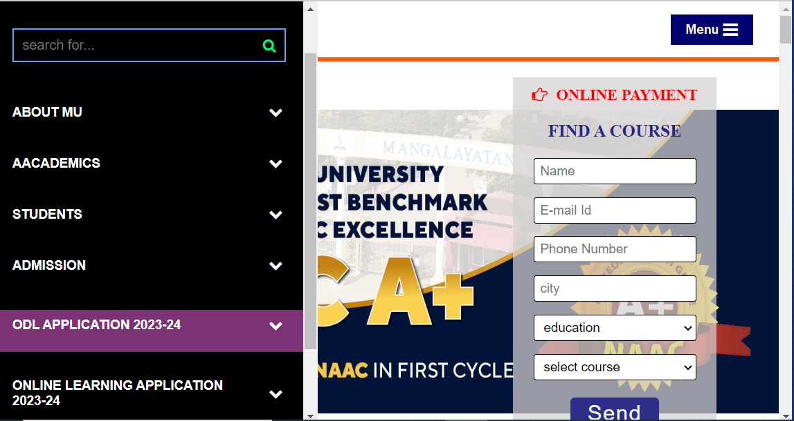
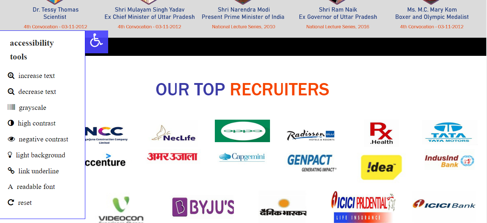
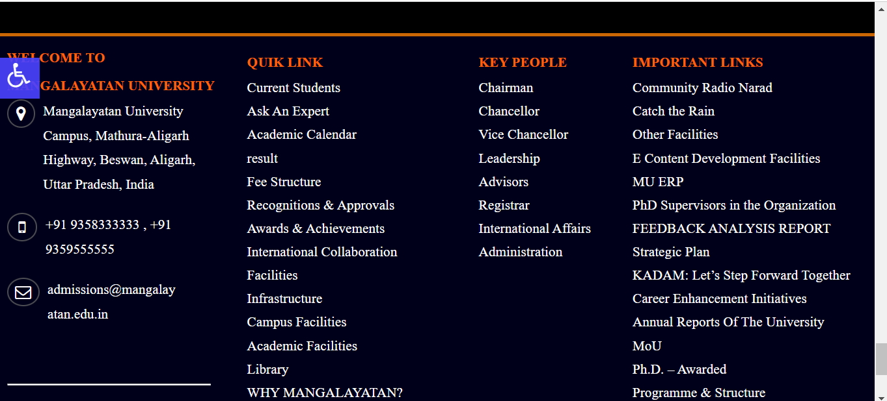

# mangalayatan university

this is a clone of mangalayatan university , i tried to make it interactive so user can interec with it ,Manglayatan University is a private university established in 2006, recognised by University Grants Commission. Its campus is located in the city of Aligarh in the Indian state of Uttar Pradesh. 

## Color Reference

| Color             | Hex                                                                |
| ----------------- | ------------------------------------------------------------------ |
| Example Color |  #000000 (Black) |
| Example Color |  #ff5733 (Orange) |
| Example Color |  #f8f8f8 (White) |
| Example Color |  #00b48a (Blue) |

## Demo

### Feature 1: [Feature Name]
- full responsive
- user interactive
- added some good style 
- slide menu bar 

## images

this is first top page , i added some list when hover on it there are also list inside it

these are university visitors list

this will pen when width will reduce so navbar will open when click on menu 

this icon basically silde from left to right when click on it 
and are some recruitres list

this is my footer page

## Documentation

### Installation

this is html,css based project , so just click on live server and you can run it 

### Usage

you can use in different cases, like slide bar, how can make responsive, how can add animation etc...

### reach out

you can reach out my project 

[mangalayatan university](https://656b0f5d9cf6c73157d9d33a--extraordinary-cheesecake-bd5ce3.netlify.app/): 

## Features

- Fullscreen mode
- Cross platform
- full responive
- user interactive
- animation propertie
- slidebar
- beautiful stylying

## 🚀 About Me
my name is harshit kumar sharma , im a front end doveloper

## 🔗 Links

## Other Common Github Profile Sections
👩‍💻 I'm currently working on react projects

## 🛠 Skills
 HTML, CSS

